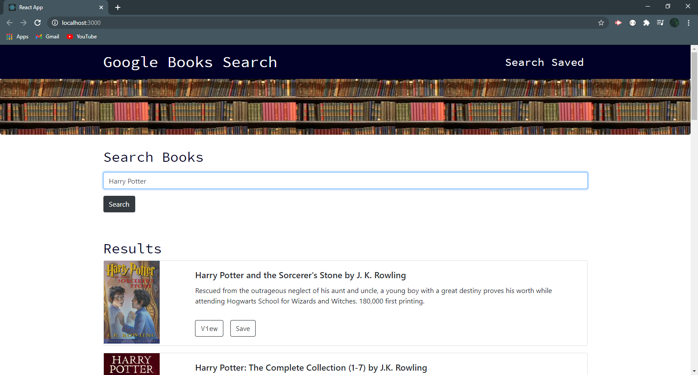
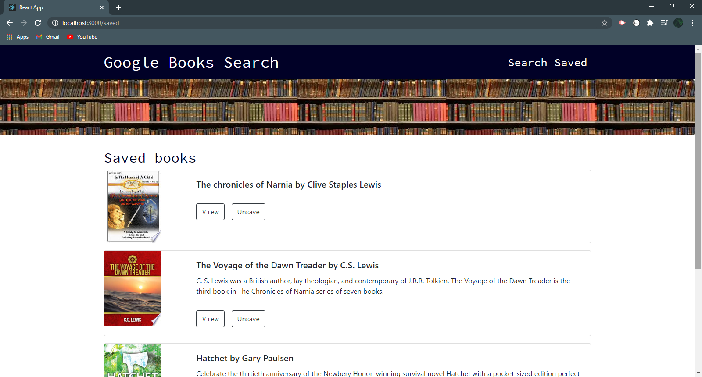

# Google Books Search
<a href="https://afternoon-ravine-72569.herokuapp.com/">Click to Visit My Page!</a>  
## Overview
React-based Google Books Search app. 
 This assignment requires you to create React components, work with helper/util functions, and utilize React lifecycle methods to query and display books based on user searches. You'll also use Node, Express and MongoDB so that users can save books to review or purchase later.

  

 

 
 
## Questions
[Visit my repository!](https://www.github.com/alexemrob)
 
For any further questions email me at AlexEmRob@gmail.com
